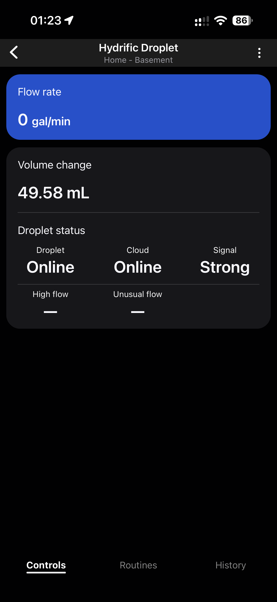
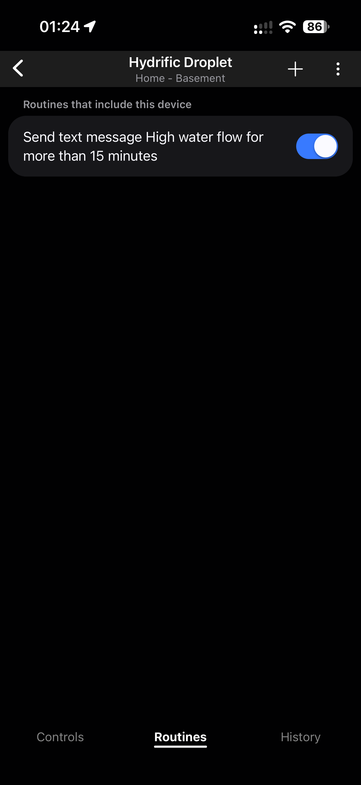
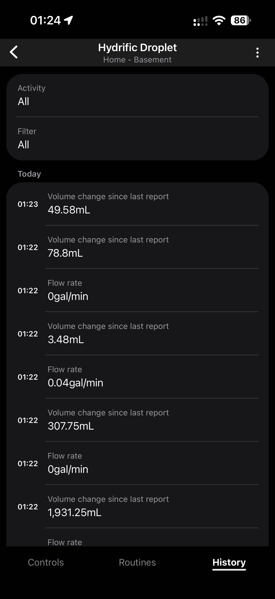

# Droplet SmartThings

An unofficial SmartThings Edge driver that connects directly to Hydrific Droplet over your local network. No MQTT broker, Home Assistant installation, or always-on computer is needed to run it.

**Status:** Development driver installed and paired successfully with a physical Droplet. Live flow, volume changes, server connectivity, and signal readings are verified. Local protocol and lifecycle tests pass. High/unusual flow alert delivery remains under investigation; do not assume unavailable alerts mean normal.

## In the SmartThings app

Screenshots from the paired device on September 29, 2026. Click an image to view it at full size.

<table>
  <tr><th>Controls</th><th>Routines</th><th>History</th></tr>
  <tr>
    <td><a href="docs/images/controls.png"></a></td>
    <td><a href="docs/images/routines.png"></a></td>
    <td><a href="docs/images/history.png"></a></td>
  </tr>
</table>

Controls and History show US gallons per minute working, including a nonzero flow reading. Volume change remains in milliliters. The Routines screenshot shows an enabled user-created routine; it does not verify its conditions or successful notification delivery. The alert dashes mean status unavailable, as described in the [firmware note](#firmware-141-unavailable-alert-status).

## Setup

1. In the **Droplet** app, open **Settings → Smart Home Integrations → Home Assistant** (sometimes labeled **Home Assistant Core**). Enable it and keep the displayed pairing code. Give Droplet a minute or two to enable the service.
2. Install this Edge driver on your SmartThings hub through your development channel.
3. In the **SmartThings** mobile app, use **Add device → Scan nearby** while your hub and Droplet are on the same local network.
4. Open the discovered **Hydrific Droplet** device and enter its **Droplet pairing code** in device **Settings**. Leave the optional IP address blank to use discovery.
5. Check that connection status says **Online**. Alert readings normally arrive separately; see the firmware note below if they remain **—**.

The code is stored as a SmartThings device preference, not in this repository. Do not put pairing codes, device credentials, or personal network details in GitHub issues.

## Readings

- Current flow, selectable as L/min or US gal/min in device **Settings → Flow units**. The default is L/min; changing units updates the last reading immediately. Review existing flow-based routine thresholds when changing units.
- Volume **since the preceding Droplet report**, in mL. This is not a daily or lifetime total. Small negative values are retained.
- Sensor signal and Hydrific server connectivity.
- High flow and unusual flow alerts: `detected`, `clear`, or `unknown` (displayed as **Alert**, **Clear**, or **—**). A dash means no current alert status is available; it does not mean clear.

The driver does not turn unavailable alerts into a clear state. Alerts become unknown after disconnect, loss of Hydrific server connectivity, or 90 seconds without an alert update. Existing flow/volume values can remain visible as historical values when the device is offline.

Alert conditions can be used in SmartThings routines through the custom status capability. Hydrific's high/unusual flow detection requires its server connection and compatible firmware (v1.4.0 or later). Local measurements do not require Hydrific cloud connectivity.

## Choosing flow units

Open **Hydrific Droplet → ⋮ → Settings → Flow units** and choose **Liters/min (L/min)** or **US gallons/min (gal/min)**. The default is liters. The conversion uses **1 US gallon = 3.785411784 liters**; these are not Imperial gallons.

Changing units updates the latest flow reading, including when it is zero, without reconnecting Droplet. Both directions have been checked on the physical hub. The unit setting applies to flow only; volume change stays in mL. Older History entries retain the units recorded at the time.

## Routines

A routine can use the numeric **Flow rate** condition to compare the reading with a chosen threshold. Review the threshold and displayed unit after changing flow units. Test the complete routine separately before relying on its notification action; an enabled toggle alone does not establish that it has triggered successfully.

Numeric flow conditions and Hydrific's **High flow / Unusual flow** statuses are separate inputs. While the latter show **—**, they cannot provide a current clear/detected status for a routine. The driver does not reproduce Hydrific's cloud alert detection from the numeric flow reading.

## Discovery and identity

The driver discovers `_droplet._tcp` services on the LAN. Each advertised host gets its own SmartThings device. Your pairing code is sent in the local API's authorization header. After the first successful metadata response, the driver stores the Droplet ID and rejects a different ID on subsequent connections. Automatic rediscovery handles IP address changes while the advertised hostname remains unchanged.

The optional address field overrides discovery for an already discovered device; it does not create a device when discovery is unavailable. To pair a replacement Droplet with a different ID, remove the old integration device and scan again.

## Connection security

Connections use TLS to the local `/ws` endpoint. Hydrific's documented protocol uses a device certificate without CA/hostname verification; this driver follows that behavior and only connects to private or link-local IPv4 addresses. Encryption does not authenticate the server certificate, so use a trusted LAN. Device-ID pinning is an additional consistency check, not cryptographic certificate pinning. No network/router security settings are changed.

The driver does not log pairing codes, authorization headers, or sensor payloads. It reconnects with bounded backoff and handles server ping/pong frames. Hydrific documents at most two simultaneous WebSocket clients. An [upstream report](https://github.com/Hydrific/pydroplet/issues/9#issuecomment-5820758888) says v1.4.1 fixed the concurrent-client frame loss seen on v1.4.0, but also reports connection eviction when additional connections are attempted. Avoid extra diagnostic connections during normal operation. The driver logs a one-time count of received and recognized alert fields after its initial 90 seconds, without logging the pairing code or raw message contents.

## Development

```sh
luajit tests/run.lua
luajit tests/lifecycle.lua
smartthings edge:drivers:package driver --build-only dist/droplet.zip
```

Create `dist/` before building. `driver/` contains the deployable Lua sources and device profile; `capabilities/` contains the custom capabilities and their mobile presentations. The English display labels are defined in `capabilities/*.en.json`. Apply those using `smartthings capabilities:translations:upsert`; use `capabilities:presentation:update` for existing presentations. The current profile references capability IDs in the development account's namespace. Other developers must create capabilities in their own namespace and update those references.

The source code lives in this GitHub repository. Packaged driver versions are uploaded to SmartThings under the developer account, assigned to a channel, and installed on the hub, where the driver runs locally. To inspect your hub, open [SmartThings Advanced → Hubs](https://my.smartthings.com/advanced/hubs/).

The development channel is **Hydrific Droplet** and uses the published [terms of use](https://github.com/hexbus/droplet-smartthings/blob/main/TERMS.md). No public sharing invitation has been created. The public repository alone does not grant channel access.

### Flow capability migration

The active flow capability is `dictionaryguide60352.dropletflowrate`; the original `dropletflow` files are retained as legacy definitions. Updating the original unit enum did not refresh the hub's cached schema, so existing devices migrate automatically to the new capability. Existing routines referencing the original flow capability must select the new Flow rate condition again. Pairing and other capabilities are retained.

## Firmware 1.4.1: unavailable alert status

As of September 29, 2026, our physical-device checks on v1.4.1 receive flow, volume, server connectivity, and signal, but no `high_leak` or `low_leak` fields. Both alerts are configured in the Droplet app, which reports normal. A hub-only 90-second observation received three state reports and zero alert fields; separate local-client observations also received no alert fields.

Another developer [reported the same missing fields after upgrading from v1.4.0 to v1.4.1](https://github.com/Hydrific/pydroplet/issues/9#issuecomment-5820758888). A Hydrific maintainer [said the remaining issues were being investigated](https://github.com/Hydrific/pydroplet/issues/9#issuecomment-5834208136). This is evidence of a possible firmware regression, not a confirmed root cause or a promised fix date.

The driver keeps these statuses unavailable (**—**) until valid alert messages arrive. Re-pairing or changing alert thresholds is not an established workaround. Flow and volume reporting can continue independently.


## Troubleshooting

- After a driver/display update, leave the device page and reopen it. The mobile app may cache older labels. You should not need to pair again.
- The pairing preference is text even if the mobile app displays a length range. Enter the letters and numbers from Droplet. The driver strips whitespace and accepts lowercase entry.
- If flow works but alerts remain unavailable, confirm alert configuration in Droplet and cloud connectivity. Do not replace missing alert fields with `clear`. Use the driver diagnostic counts to distinguish absent messages from unrecognized values.
- If the CLI intermittently returns an undefined HTTP status on a dual-stack Mac, retry the command with `NODE_OPTIONS=--dns-result-order=ipv4first`; this affects that command only.

## References

- [Hydrific local API specification](https://help.hydrificwater.com/en/articles/12364800-smart-home-api-technical-specifications)
- [Hydrific reference implementation](https://github.com/Hydrific/pydroplet)
- [Droplet integration setup and data notes](https://www.home-assistant.io/integrations/droplet/)
- [SmartThings LAN driver guide](https://developer.smartthings.com/docs/devices/hub-connected/lan)
- [SmartThings mDNS API](https://developer.smartthings.com/docs/edge-device-drivers/mdns.html)

This project is not affiliated with or endorsed by Hydrific or Samsung SmartThings.
